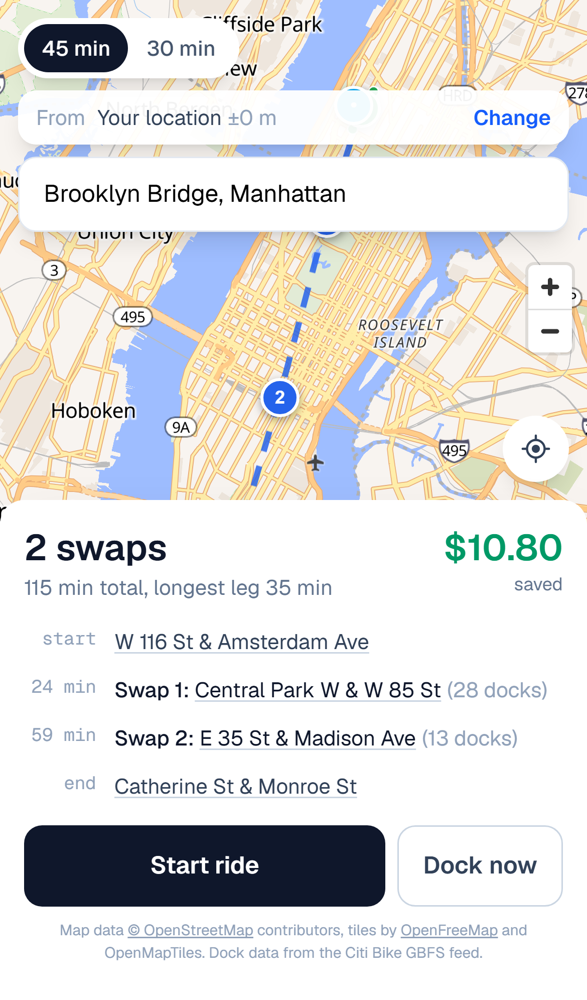
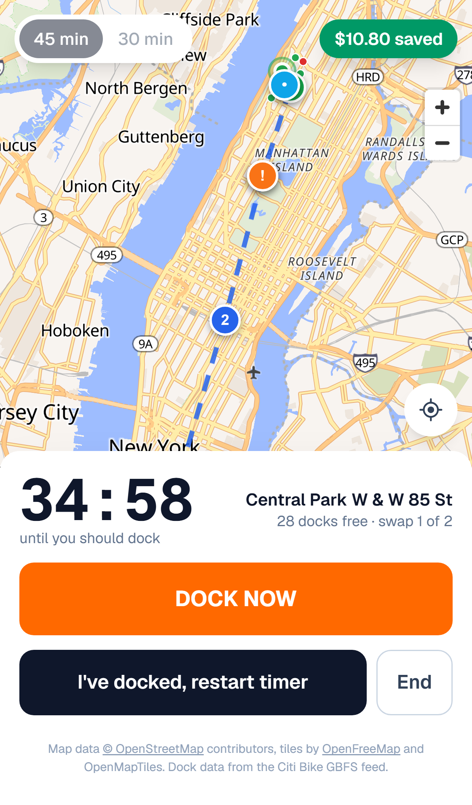
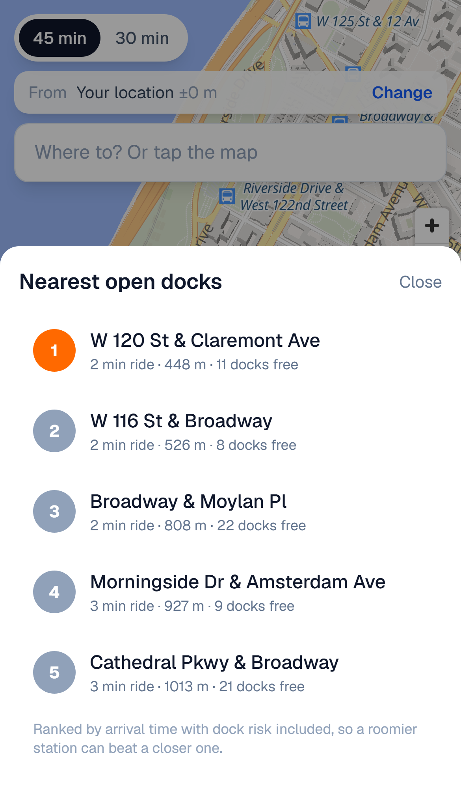
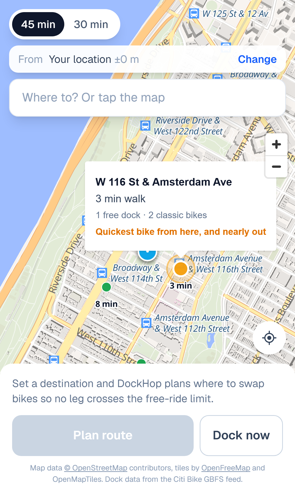

# DockHop

Citi Bike gives annual members 45 minutes per ride and day pass riders 30. Go over and
the meter starts at $0.27 or $0.41 a minute. The official way around it is to dock the
bike, wait for the green light, and pull it straight back out, which restarts the clock.

Almost nobody does this, because doing it well means knowing which docks along your route
will still have a free space when you get there.

DockHop plans that for you. Give it a start and a destination and it returns the route
plus the specific stations to swap at, chosen so no single leg ever crosses the free
limit, and it keeps checking those stations while you ride.

Live at **[dockhop.dwarakesh.com](https://dockhop.dwarakesh.com)**, against the real feed.
Built for a phone, so it is worth opening on one.

<p align="center">
  
  
</p>

## The problem is the docks, not the route

Citi Bike publishes a live GBFS feed for all 2,507 stations. Sampling it:

| | stations |
|---|---|
| operational | 2,412 |
| completely full, zero free docks | 172 |
| down to one or two free docks | 289 |

So about 7% of the network cannot accept a bike at any given moment, and another 12% is
one or two riders away from that. A planner that only knows where stations *are* sends
you to a station you cannot use roughly one time in five.

That is why the whole design is built around live dock counts rather than a map of
station locations, and why a nearly full dock is penalised instead of merely noted.

## What it produces

Columbia to the Brooklyn Bridge, about 11 km, planned against the live feed:

```
Annual member (45 min cap)
  start   W 113 St & Broadway
  swap    minute 32   Central Park W & W 72 St     (28 min leg, 25 docks free)
  swap    minute 64   Madison Ave & E 26 St        (31 min leg, 26 docks free)
  finish  Catherine St & Monroe St

  101 min total, longest leg 31 min against a 45 min limit
  saved $10.53
```

The same trip on a day pass needs three swaps and saves $22.14. Tourists have the tighter
cap, the higher penalty rate, and the least idea that any of this is possible.

Planning takes about 4 ms across all 2,507 stations.

## How it works

The search is a Dijkstra over ride edges between stations. An edge from station A to
station B exists only if the ride fits inside the leg budget and B currently has a free
dock. Walking to the first station and away from the last is folded into the source and
sink costs.

Three decisions that carry most of the weight:

**Interior legs are estimated, the ends are routed.** The search evaluates thousands of
candidate edges, and calling a routing API for each one would blow through any free tier
immediately, so those use a fitted distance model biased deliberately slow. The two ends
are different: there are only a dozen or so docks in play, the rider is on foot, and a
straight line is wrong there in a way that changes the answer. Those get real routes.
Why that matters has its own section below.

**Dock risk is priced in seconds.** A station with one free space is not excluded, it is
charged a 240 second penalty. That lets the search trade dock risk against detour time on
its own, so riding 350 m further to a station with 20 spaces beats stopping at the one
with 1.

The cost is a list that can look mis-sorted, because it ranks by arrival time with that
penalty folded in while every row shows plain distance, and the two do not agree. A
roomier dock further out beats a nearly full one, and so does a dock that is marginally
further but quicker to ride to on one-way streets.

I made that much worse before I made it better. Each row was badged with its ETA in
minutes, sitting immediately left of the station name, which reads as a position in a
list. So the top pick was labelled 2 above a row labelled 1, and a correctly ranked list
looked scrambled. Rows are numbered by rank now, the minutes moved into the detail line
where they are labelled as a ride time, and a row that is nearer than the recommendation
says why it lost anyway. Ranking that overrules what the rider can see for themselves has
to explain itself, or it reads as a bug.

<p align="center">
  
</p>

**A station you walked to and a station you rode into are different states.** They cannot
share a predecessor slot, or reconstructing the path splices in a station the rider never
visits. That one cost me an afternoon and has a regression test named after it.

## Straight lines lie, and they lie worst at the doorstep

<p align="center">
  
</p>

Ranking docks by straight-line distance is the obvious approach and it is wrong often
enough to matter. Standing outside Columbia and asking for the nearest docks:

| dock | straight line | actual walk | |
|---|---|---|---|
| W 116 St & Broadway | 148 m | **861 m, 10 min** | campus is closed through the middle |
| W 116 St & Amsterdam Ave | 179 m | 250 m, 3 min | |
| W 113 St & Broadway | 259 m | 713 m, 8 min | |

The nearest dock on the map is a ten minute walk. The one that looks 30 m further is
three. Crow flies does not just misjudge the distance, it picks the wrong dock, and the
rider pays for it in the currency the whole app is about. Rivers make it worse: a dock 537 m
away across the Harlem River is a 3.2 km walk, six times the straight line, because the
nearest bridge is nowhere near it.

So the docks at each end of a trip, and the ones drawn on the map, are ranked by routed
travel time from [Valhalla](https://valhalla.github.io/valhalla/), which is free, needs no
key, and has genuine pedestrian and cycling profiles. Which profile depends on what the
rider is doing: walking before the ride starts, cycling once they are on a bike and looking
for somewhere to put it. A one-to-many matrix for sixty docks takes about 350 ms, and the
results are cached at the edge for six hours because street layouts do not change.

Two details that took a while to get right:

**Routing is an improvement, never a dependency.** Every call can return nothing, and every
caller carries a straight-line fallback. A Valhalla outage costs the ranking its edge; it
does not cost the rider a plan. The planner itself makes no network calls at all, which is
what keeps it testable.

**A coordinate on the waterfront will snap to a ferry.** Asking for the walk from the
Brooklyn Bridge to a dock 615 m away came back as 10.9 km, because the destination matched
onto the Seastreak route to New Jersey and the router happily walked the rider up the
gangway. Excluding ferry edges when the point is matched to the network returns 2.1 km on
foot, and leaves every inland answer byte for byte identical.

**What counts as a usable dock depends on which way you are facing.** This one only showed
up against live data: the app was recommending the station 3 minutes away with 27 free
docks and no bikes in it to somebody who had not started riding yet. Before a ride you need
a classic bike to take; during one you need somewhere to put it back. The same station is
perfect for one and worthless for the other, so red, amber and green now follow whichever
the rider is short of.

## What the calibration was actually worth

Citi Bike publishes every trip it has carried, with start and end coordinates and the exact
billed duration. `scripts/calibrate.py` fits the travel model against a month of it: 3.9
million rides, of which 988,000 are classic bikes. Two parameters, a fixed cost to get
moving and a per-metre rate, fitted at the 85th percentile rather than the mean, because
being wrong slow costs nothing and being wrong fast is what gets someone charged.

Then I checked whether any of that mattered, by scoring the models on the only thing a
rider cares about. A leg is planned only if the model believes it fits, so the question is
how many of the legs a model accepts actually run past the fee threshold:

```
py scripts/calibrate.py --compare
```

```
member: legs planned under 35 min, charged past 45 min
  flat rate only (0.45 s/m, no intercept)     1.08%
  reasonable guess (8 mph, detour, 15% pad)   1.11%
  fitted to trip history                      1.05%

day pass: legs planned under 25 min, charged past 30 min
  flat rate only (0.45 s/m, no intercept)     2.96%
  reasonable guess (8 mph, detour, 15% pad)   3.06%
  fitted to trip history                      2.75%
```

For members, fitting a model to a million rides beats a flat rate by five hundredths of a
percentage point. The ten minute gap between the target leg and the fee threshold absorbs
almost all estimate error, so the buffer is doing the safety work, not the model.

The day pass column is where it earns anything, 3.06% down to 2.75%, and the reason is
structural rather than clever: five minutes of slack instead of ten, so model error stops
being absorbed and starts reaching the rider.

So the calibration is not what makes the app safe. What it bought is the evidence that the
buffer is enough. Before fitting, I had no way to tell whether my guess at cycling speed
was 10% optimistic or 40%, and that difference decides whether ten minutes of slack is a
margin or a decoration. It turned out to be 10 to 13% fast, comfortably inside. That is
worth knowing once. It was not worth being precious about.

One diagnostic did change the model. Coverage looked fine at 85% overall but sagged to 80%
between 2 and 4 km, which is exactly where the planner operates, because 9 km commutes in
the tail were bending the line away from the range that matters. Restricting the fit to the
distances the planner emits raised the worst band to 81.8%, and removed a parameter rather
than adding one.

The fitted numbers are guarded by tests, so a bad recalibration fails CI rather than
reaching riders.

## Tests

79 unit tests and 43 browser tests, the latter run against both a mobile and a desktop
profile, in CI on every push. A further six run against the live Citi Bike feed and the
live routing service, opt-in rather than in CI, because an upstream outage is not a reason
for this repo to go red.

The one that matters treats the leg cap as a safety property rather than a happy path.
Across 200 randomly generated station networks and both fare modes, it asserts that no
ride leg ever exceeds the target. That is the single invariant that costs a user real
money if it breaks, so it is checked against generated inputs rather than a handful of
examples.

The rest cover the failure modes, which matter more than the successes here: no bike near
the start, no free dock near the destination, a corridor gap too wide to cross in one leg.
Each returns a specific reason rather than a route that cannot be ridden.

The routing layer is tested from both ends. One test asserts that a routed walk changes
which dock gets picked, and a second asserts that without routing the planner picks the
wrong one, so the feature is pinned by the bug it fixes rather than by its own output.
Four more make the fallbacks explicit: a timeout, an error, a malformed body and a single
unroutable dock all have to degrade to a straight-line estimate rather than fail.

The browser tests exist because of a bug class the unit tests cannot see. Three separate
faults each rendered a completely blank map and not one of them logged an error: a
MapLibre stylesheet rule that beat a Tailwind class in the cascade and collapsed the map
container to zero height, a module worker Next.js could not emit so vector tiles were
never requested, and effects gated on a ref that never re-ran, which silently dropped
every station that loaded before the map did. All three needed a real browser running a
real production build to reproduce, so that is what CI does now.

```bash
npx playwright test                       # stubbed endpoints, deterministic
npx playwright test --project=ios-safari  # the real iOS engine
RUN_LIVE=1 npx playwright test            # against the live GBFS feed
```

CI runs the Chromium profiles only. MapLibre needs WebGL and headless WebKit on Linux has
none, so running iOS Safari there fails every map test for a reason that has nothing to do
with the app. It runs locally instead, where WebKit is real.

## Stack

Next.js and TypeScript on Cloudflare Workers, MapLibre with OpenFreeMap tiles, and
Citi Bike's GBFS feed. Everything runs inside a free tier.

Station status is cached at the edge for 30 seconds, which is the polling floor GBFS asks
consumers to respect. One origin request per half minute no matter how many people are
navigating.

## Running it

```bash
npm install
npm run dev
```

Plan a real trip from the command line without starting the app:

```bash
npx tsx scripts/try-plan.ts            # Columbia to the Brooklyn Bridge, member
npx tsx scripts/try-plan.ts daypass    # the same trip on a 30 minute cap
```

Refit the travel model against a different month of trip history, or check it against a
flat rate:

```bash
py scripts/calibrate.py --month 202604
py scripts/calibrate.py --month 202604 --compare
```

## Limitations

Route lines are drawn straight between dock points rather than following streets, and that
is deliberate. The swap points are the product; turn by turn is solved, and every stop in
the plan links out to Google Maps by coordinate so the handoff is one tap. Note that the
*decisions* are not made on those straight lines, which is the section above.

The travel model is fitted to April, so it carries that month's weather and daylight.
Coverage is measured on held-out rides from the same month, which does not prove it
generalises to January.

Dock availability is read live but not predicted. The app knows a station has three spaces
now, not whether it will in twenty minutes. Historical GBFS snapshots would support that
and the feed is already being polled, but it is not built.

Citi Bike only, though GBFS is a standard and Capital Bikeshare publishes the same feed
shape, so other systems are mostly a config change.

Station data from the [Citi Bike GBFS feed](https://gbfs.citibikenyc.com/gbfs/gbfs.json),
licensed CC BY 4.0. Not affiliated with Citi Bike or Lyft. MIT licensed.
